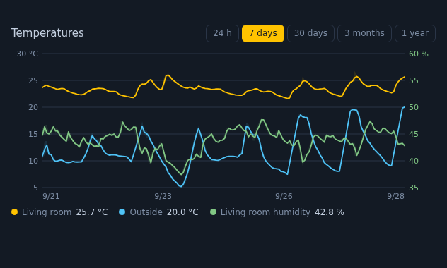

<p align="center">
  <picture>
    <source media="(prefers-color-scheme: dark)" srcset="docs/icon-dark.png">
    
  </picture>
</p>

# Long-term Chart Card

[![hacs][hacs-badge]][hacs] [![Validate][validate-badge]][validate] [![Buy Me a Coffee][bmc-badge]][bmc]



A Lovelace chart for **weeks, months and years** of data — from Home
Assistant **long-term statistics** (no extra software), or from
**InfluxDB** through the [InfluxDB Proxy][proxy] integration.

- **Long-term statistics out of the box** — Home Assistant keeps hourly
  mean/min/max forever for every numeric entity with a `state_class`. This
  card reads them directly; nothing else to install.
- **min/max band** under every line, so you see the spread, not only the average
- **two Y axes** — e.g. temperature on the left, humidity on the right —
  with the **grids aligned**, so there is one set of grid lines, not two
- **period buttons** (24 h, 7 days, 30 days, 3 months, 1 year by default)
- **tooltip** snapped to real samples, hover dots, live values in the legend
- **click the legend** to hide a series — the scale adapts to what is left
- **readable grid**: round steps (22, 24, 26 — not 21.7, 23.4), optional
  step floors so a quiet day does not look like a storm
- works on a phone: tap to see values, the tooltip stays for a few seconds
- follows your Home Assistant language (English, Polish) and number format
- **works remotely** — the card only ever talks to Home Assistant, never to
  a database directly

## Installation

### HACS

[![Open your Home Assistant instance and open this repository inside HACS.][hacs-open-badge]][hacs-open]

1. Click the button above — it adds this repository to HACS in your Home
   Assistant. Or manually: HACS → ⋮ → **Custom repositories** → add
   `https://github.com/stryczekk/long-term-chart-card`, category **Dashboard**
2. Install **Long-term Chart Card**
3. Refresh the browser (the resource is added by HACS)

### Manual

Copy `long-term-chart-card.js` to `config/www/`, then add a resource
(**Settings → Dashboards → ⋮ → Resources**): URL
`/local/long-term-chart-card.js`, type **JavaScript module**.

## Examples

Temperatures from long-term statistics:

```yaml
type: custom:long-term-chart-card
title: Temperatures
entities:
  - sensor.living_room_temperature
  - sensor.bedroom_temperature
  - entity: sensor.outside_temperature
    name: Outside
```

Temperature and humidity on two axes, a calmer grid:

```yaml
type: custom:long-term-chart-card
title: Bedroom
days: 30
y_min_step: 0.5
y_min_intervals: 4
entities:
  - sensor.bedroom_temperature
  - entity: sensor.bedroom_humidity
    axis: right
```

Years of history from InfluxDB (needs the [InfluxDB Proxy][proxy] integration):

```yaml
type: custom:long-term-chart-card
title: Heating season
source: influx
days: 365
periods:
  - { days: 30 }
  - { days: 365 }
  - { days: 730, label: 2 years }
entities:
  - sensor.living_room_temperature
```

## Options

| Option | Default | Description |
|---|---|---|
| `entities` | **required** | list of entity ids, or objects (see below) |
| `title` | — | card title |
| `source` | `statistics` | `statistics` (Home Assistant long-term statistics) or `influx` (InfluxDB Proxy) |
| `days` | second period button (7 with the default buttons) | period selected when the card loads |
| `periods` | 1, 7, 30, 90, 365 days | buttons above the chart: `{ days, label }`, label optional |
| `show_range` | `true` | draw the min/max band |
| `decimals` | `1` | decimals in the legend and tooltip |
| `y_step` | automatic | force the grid step of the primary (left) axis; the right axis keeps its own round step on the same grid lines |
| `y_min_step` | — | never pick a finer step on the left axis |
| `y_min_step_right` | — | the same for the right axis |
| `y_min_intervals` | — | widen the range to at least this many grid intervals |

Entity object:

| Key | Description |
|---|---|
| `entity` | entity id |
| `name` | label (default: friendly name) |
| `color` | a CSS colour: `#hex`, a name, `rgb()`/`hsl()` or `var(--…)`; anything else falls back to the palette of nine distinct hues |
| `axis` | `left` (default) or `right` |

## Where the data comes from

- **`source: statistics`** — `recorder/statistics_during_period`, 5-minute
  statistics for ranges up to 2 days (kept ~10 days), hourly beyond (kept
  forever). Only entities with a `state_class` have statistics.
- **`source: influx`** — `GET /api/influx_proxy/series`, served by the
  [InfluxDB Proxy][proxy] integration; aggregation step chosen for the range.

Data refreshes every 5 minutes, not on every state change.

## Development

```bash
node --test tests/          # unit tests of scales, formatting, translations
tests/browser/run.sh        # renders the card in headless Chromium and checks it
tests/browser/run.sh --shot # ...and refreshes docs/screenshot.png
```

The browser test feeds the card a fake `hass` with a real week of Home
Assistant statistics (`tests/browser/fixture.json`; the outdoor series is
cleaned of direct-sun spikes on the outdoor sensor) and checks lines, the
min/max band, both axes, the legend toggle, the tooltip, period switching,
locale formatting, the InfluxDB error paths, HTML injection through
`friendly_name`, units, names and colours, detach/re-attach, repeated
`setConfig`, out-of-order responses, wide right-axis ranges and single samples.

## Support

Everything here is free and will stay free. If it saved you an evening of
tinkering, you can [buy me a coffee][bmc] ☕ — thank you!

## License

MIT

[proxy]: https://github.com/stryczekk/ha-influx-proxy
[hacs-open]: https://my.home-assistant.io/redirect/hacs_repository/?owner=stryczekk&repository=long-term-chart-card&category=plugin
[hacs-open-badge]: https://my.home-assistant.io/badges/hacs_repository.svg
[hacs]: https://hacs.xyz
[hacs-badge]: https://img.shields.io/badge/HACS-Custom-41BDF5.svg
[validate]: https://github.com/stryczekk/long-term-chart-card/actions/workflows/validate.yml
[validate-badge]: https://github.com/stryczekk/long-term-chart-card/actions/workflows/validate.yml/badge.svg
[bmc]: https://buymeacoffee.com/stryczekk
[bmc-badge]: https://img.shields.io/badge/Buy%20Me%20a%20Coffee-support-FFDD00?logo=buymeacoffee&logoColor=black
